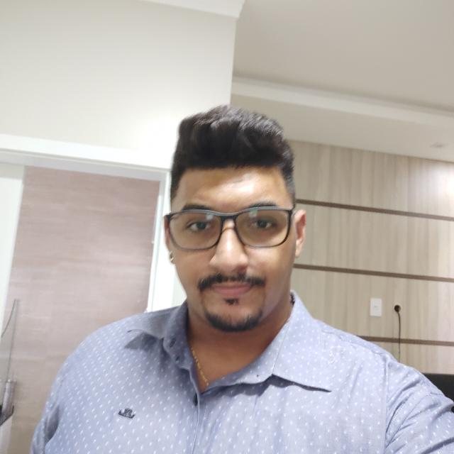
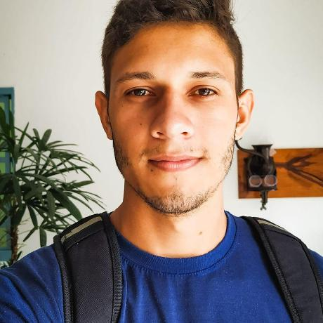

<h1 align="center"> Trabalho final da disciplina Linguagem de Programação Objeto Orientada a</h1>


## Sumário
<!--ts-->
   * [Status do Projeto](#Status_do_Projeto)
   * [Features](#Features)
   * [Pré-requisitos e como rodar a aplicação](#prerequisites)
      * [Depenências](https://github.com/rafaelomodei/darktools/wiki/Dependences)
      * [Arquitetura](https://github.com/rafaelomodei/darktools/wiki/Arquitetura)
      * [Bugs](https://github.com/rafaelomodei/darktools/wiki/Bugs)
   * [Autores](#autores)
<!--te-->


### ✅ Status do Projeto

    🚧  Dark Tools, em construção...  🚧

### ✅ Features

- [x] layout UI
- [x] Criar cenas
- [x] Implementação da história
- [x] Salvar jogo


### ✅ Pré-requisitos e como rodar a aplicação

Antes de começar, você vai precisar ter instalado em sua máquina as seguintes ferramentas:
- [JDK 8u111 with NetBeans 8.2](https://www.oracle.com/technetwork/java/javase/downloads/jdk-netbeans-jsp-3413139-esa.html) ``` Versão: 8.2 ```

#### 🛠 [Dependências](https://github.com/rafaelomodei/darktools/wiki/Dependences)

#### ⚙ [Arquitetura](https://github.com/rafaelomodei/darktools/wiki/Arquitetura)

#### 🛠 [Bugs](https://github.com/rafaelomodei/darktools/wiki/Bugs)

<h2 align="center">Autores<h3/>

<table align="center">
  <tr>
    <td align="center"><a href="https://github.com/jefersoncmn"><br/><sub><b>Jeferson Carlos Martin</b></sub></a><br /><a href="https://github.com/jefersoncmn" title="Jeferson Carlos Martin"></a>
    </td>
    <td align="center"><a href="https://github.com/pedro182haa"><br/><sub><b>Pedro Henrique Alves dos Anjos</b></sub></a><br /><a href="https://github.com/pedro182haa" title="Pedro Henrique Alves dos Anjos"></a>
    </td>
    <td align="center"><a href="https://github.com/rafaelomodei"><br/><sub><b>Rafael Geovani Omodei</b></sub></a><br /><a href="https://github.com/rafaelomodei" title="Jeferson Carlos Martin"></a>
    </td>
</table>

### Agradecimentos
Agradecimentos a toda equipe e envolvidos, pelo esforço e interesse em aprender.
